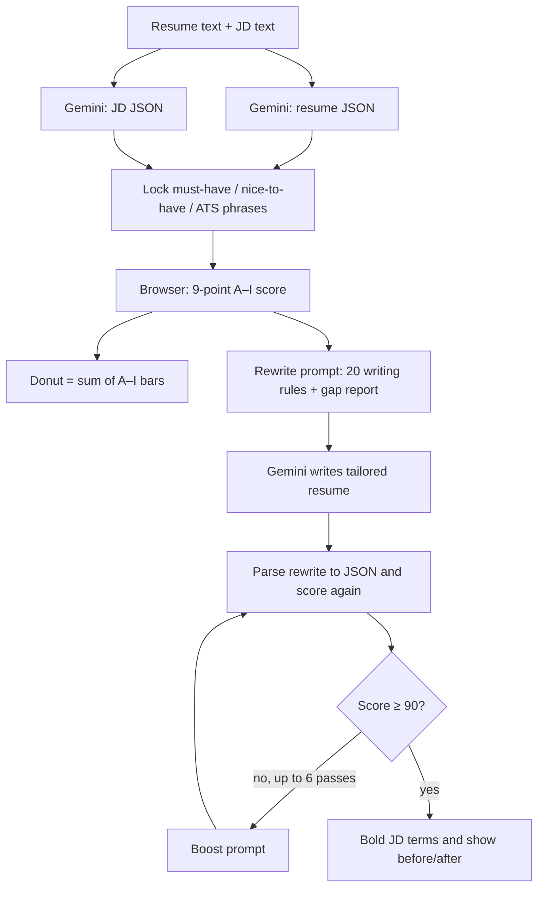

# How the Jobilly resume dashboard works

This app scores a resume against a job posting, then rewrites the resume so it reads as that role. The number on the donut is **JD alignment (A–I, 100 points)**. It is not a predicted Workday / Greenhouse / ATS vendor percentage.

Gemini structures text into JSON and writes the tailored resume. The numeric score is computed in the browser from those JSON objects. Gemini does not assign the score.

---

## What you do in the UI

1. Paste (or upload) a **base resume**.
2. Paste a **job description**. You can keep several JDs as tabs; the same base resume is reused.
3. Choose a rewrite mode:
   - **Stay truthful** — only JD must-have skills are added.
   - **Stretch for the posting** — also weaves nice-to-have and market skills.
4. Click **Score (score rule)** — required before rewrite.
5. Click **Rewrite resume** — Gemini writes a new resume from the score-rule gap report.
6. Optionally **Push the score** if the rewrite is below 95.

Workspace (resume, JD tabs, mode) is stored in `sessionStorage` as `jobilly_workspace_v1`. Closing the tab clears it.

---

## Architecture

```
index.html          UI shell, chip colors, before/after rewrite panels
app.js              Scoring, rewrite prompts, workspace, all dashboard logic
rag-engine.js       Offline keyword/skill fallback if Gemini is down
server.py           Local static server + /api/gemini + /api/extract-resume
api_core.py         Shared Gemini + extract handlers (local and Vercel)
api/gemini.py       Vercel serverless Gemini proxy
api/extract-resume.py
resume_extract.py   PDF / DOCX / TXT text extraction
resume_test/        JSON schemas, converters, sample JD, QA harness
```

**Local:** `python server.py` (default `http://127.0.0.1:8765`). Needs `GEMINI_API_KEY` in `.env` or `.env.local`.

**Production:** static files + Vercel functions in `api/`. `vercel.json` sets 60s for Gemini and 30s for extract.

The browser calls `/api/gemini` with a prompt. The Python proxy talks to Google Generative Language (`gemini-2.5-flash-lite`, then flash-lite-latest / 2.0-flash / 2.5-flash). Temperature is 0.

---

## End-to-end pipeline



You must click **Score** first. Rewrite uses that frozen report (`manualScoreUnified`) as the gap source. It does not re-score the original resume immediately before writing.

---

## JSON is the source of truth

Raw paste is converted into two schemas:

| File | Script | What it captures |
| --- | --- | --- |
| `resume_test/jsonresume.txt` | `resume_test/to_resume_json.py` | Name, summary, education, skill buckets, jobs + bullets |
| `resume_test/jsonjd.txt` | `resume_test/to_jd_json.py` | Title, years, must-haves, nice-to-haves, `ats_phrases`, duties, eligibility |

In the dashboard, `parseResumeToJson` / `parseJdToJson` do the same conversion. If Gemini fails, a local heuristic parser (`parseResumeToJsonLocal`) still fills the same shape.

Scoring prefers JSON fields over raw text:

- Must-have tools come from `must_have_skills` (duty phrases are stripped out).
- Years come from `years_of_experience.minimum` / `maximum` / `note`.
- Duties come from `responsibilities`.
- Industry is scored **only** if the JD explicitly requires that industry (healthcare, mortgage, etc.). `domain_industry` alone is not a gate.

CLI converters (from the repo root, with Gemini configured):

```bash
python resume_test/to_resume_json.py path/to/resume.txt
python resume_test/to_jd_json.py path/to/jd.txt
```

---

## The 9-point score (A–I)

`scoreWithNinePointRule` → `applyScoreRuleFromCoverage` in `app.js`.

Each category is **(matched checks ÷ total checks) × category weight**. The donut always equals the sum of the bars (`syncDisplayedAlignmentScore`). There is no second blended “ATS %”.

| Letter | Key | Points | What it checks |
| --- | --- | --- | --- |
| **A** | `hardQualifications` | 20 | Years vs JD, education, work auth if stated, industry **only if the JD requires it** |
| **B** | `skillsKeywords` | 20 | JD must-have **tools** only. In experience = 1.0, Skills-only ≈ 0.45, missing = 0. Tool-dump bullets are discounted |
| **C** | `semanticResponsibilityMatch` | 20 | Experience bullets overlap JD duty language (~35% of meaningful words) |
| **D** | `skillsEvidenceContext` | 10 | Must-haves proved with action + context, not a Skills dump |
| **E** | `experienceSeniorityMatch` | 10 | Years, ownership language, seniority vs posting, ≥2 dated jobs |
| **F** | `achievementsImpact` | 8 | Result verbs, real numbers when they exist, few “responsible for” bullets |
| **G** | `resumeParsingStructure` | 5 | Summary, Skills, Experience, Education, company/title/dates |
| **H** | `jobTitleAlignment` | 2 | Role **family** match. Past titles are not rewritten to copy the JD |
| **I** | `recruiterReadability` | 5 | 10-second scan: role, years, strongest tools, employers, short bullets |

**Thresholds:** rewrite aims for **90+**. **Push the score** aims for **95+**. Max boost passes on rewrite: 6. Push: 4.

### Hard knockouts (shown separately)

Clearance, license language, on-site location. These can screen someone out even if the 100-point total is high. They are **not** extra A–I points.

### Years

- `"1–6 years"` → min 1, max 6 (range, not “6+”).
- `"5+ years"` → min 5, no max.
- Candidate is eligible if years ≥ min − 1, and (if max exists) ≤ max + 0.51. A 5.8-year candidate is eligible for a 1–6 posting. Extra years above a minimum-only “5+” posting do not fail eligibility.

---

## Skill chips (what you see vs what is scored)

**Scored (category B)** = JD must-have **tools** (`Python`, `PyTorch`, `Airflow`). Long duty phrases and job titles (`Machine Learning Engineering`, `production-grade ML systems deployment`) are **not** B skills (`isDutyPhraseNotSkill`).

Chip colors:

| Color | Class | Meaning |
| --- | --- | --- |
| Teal | `kw-match` | Must-have found in **work history** |
| Gold | `kw-skills` | Must-have in **Skills only** (weaker for B and D) |
| Pink | `kw-miss` | Must-have missing |
| Purple | `kw-stretch` | Nice-to-have — **not scored** |
| Orange | `kw-ats` / `kw-ats-on` | ATS phrases — woven in rewrite, **no extra A–I points** |

ATS phrases come from JD `ats_phrases`, plus duty-like strings that were stripped out of must-haves. They are shown and prompted into bullets; they do not raise the 100-point total on their own.

Certifications and visa/sponsorship wording are dropped from skill lists. They belong in A (hard gates) when the JD actually requires them.

---

## Rewrite: two different “rules”

**Numeric score** = A–I only. Do not invent a second rubric.

**Writing instructions** = 20 US full-time resume rules, sent to Gemini as prompt text (`formatTwentyRulesRewriteBlock`):

1–2 pages, tailor to the JD, no unevidenced skills, action → technology → problem → result, quantify only real numbers, achievements over duties, strongest info in the top third, JD terminology when true, no graphics/tables, no sensitive PII, concise education, experience is the main section, interview-defensible tech, do not exaggerate ownership, show progression, look like a targeted JD resume.

The rewrite prompt also includes:

- Locked must-haves and (in Stretch) nice-to-haves
- ATS phrases to weave naturally
- The last score-rule gap report (weak A–I categories + glance fails)
- Format contract (Name / Title / Contact, ALL-CAPS headers, `- ` bullets)
- Cloud-stack guardrails: do not mix rival clouds in one bullet; stay on the candidate’s evidenced stack

**Stay truthful** will not add Stretch-only / market tools. **Stretch** will.

After Gemini returns text, the app:

1. Cleans formatting.
2. Parses the rewrite into resume JSON and scores it with the same A–I function.
3. Loops boost prompts until 90+ (or 6 passes).
4. Optionally runs one extra “layout + keyword” polish if still under 90.
5. Bolds JD terms (`finalizeBolding`).
6. Shows **before/after** donuts and A–I bars (grey = before, color = after). Click a category for both reports.

The original Score panel stays the **before** snapshot.

---

## Gemini vs local RAG

| Step | Primary | Fallback |
| --- | --- | --- |
| Resume / JD → JSON | Gemini | Local section parser / `rag-engine.js` keyword packs |
| Keyword lock | JD JSON (`keywordsFromJdJson`) | `RAGEngine` skill KB + role packs |
| Numeric score | Always local A–I in `app.js` | `rag-engine.js` `computeAtsScore` if JSON is missing |
| Rewrite / boost | Gemini | No rewrite without Gemini |

Internet/market skills may appear in Stretch UI. They are **never** mixed into the scored primary list (`keywordsForScoring`).

Candidate stack detection (`CANDIDATE_STACKS`: AWS / Azure / GCP, plus role families) filters rival-cloud keywords so an AWS resume is not dinged for missing Azure tools the JD listed as optional color.

---

## File upload and APIs

- Upload PDF / DOCX / TXT → `POST /api/extract-resume` → `resume_extract.py`.
- All LLM calls → `POST /api/gemini` `{ prompt, json, maxTokens }`.
- `GET /api/health` reports whether `GEMINI_API_KEY` is present.

HTML → PDF export uses `lib/html2pdf.bundle.min.js` in the browser.

---

## QA and samples

| Path | Role |
| --- | --- |
| `resume_test/_samples/sample_data_engineer_aws.txt` | Sample AWS Data Engineer JD |
| `resume_test/_json/sample_data_engineer_aws.jd.json` | Structured version of that JD |
| `resume_test/run_qa.py` | Batch extract + rewrite vs several canned JDs; writes `_qa_out/` |

Do not commit personal resume JSON. Samples and schemas are fine.

---

## Mental model

```
JD JSON  ──must-have tools──►  B + D
         ──duties──────────►  C
         ──years/edu/auth──►  A (+ knockouts)
         ──ats_phrases─────►  chips + rewrite wording only
Resume JSON ──bullets/skills/dates──►  all categories
20 writing rules ──►  how Gemini writes
A–I weights      ──►  the only number on the donut
```

If Match and the A–I bars ever disagree, that is a bug. They are forced equal.
